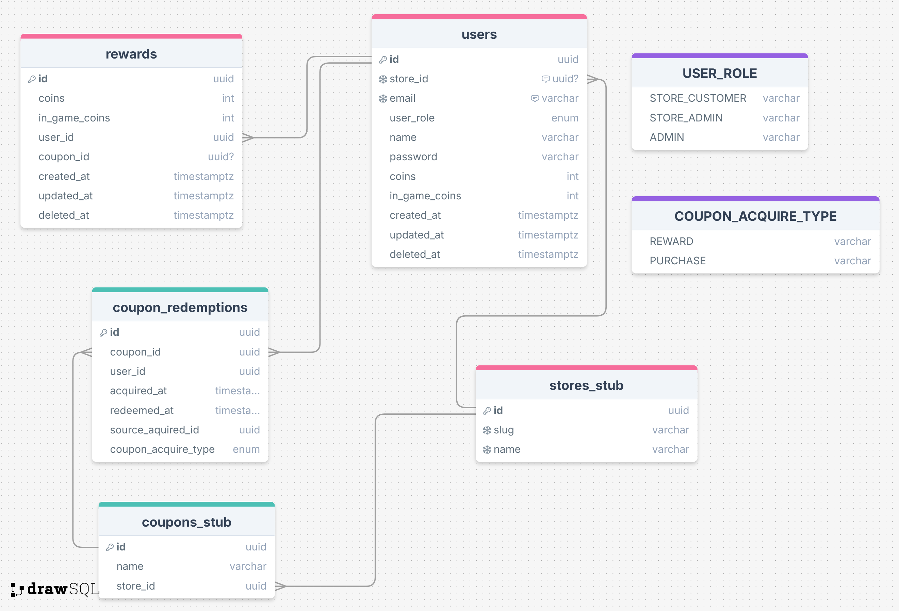

# gameficato-online

Protótipo do Frontend padrão:
https://www.figma.com/design/YFaFwXm3tdsyajZ61WOTVj/Gameficato-Online?node-id=0-1&t=RN3MX7bvSmGK6fWv-1

ER do Banco de dados do Store-Service:
link: https://drawsql.app/teams/christians-team-11/diagrams/gameficato-store-service

ER do Banco de dados do Customer-Service:
https://drawsql.app/teams/christians-team-11/diagrams/gameficato-customer-service

ER do Banco de dados do serviço original (sem a divisão em microsserviços):
https://drawsql.app/teams/christians-team-11/diagrams/gameficato-online
