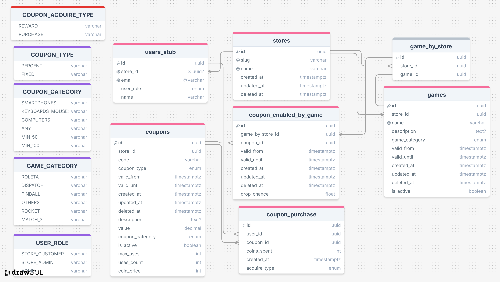

# gameficato-online

### Artefatos

* Protótipo do Frontend padrão: https://www.figma.com/design/YFaFwXm3tdsyajZ61WOTVj/Gameficato-Online?node-id=0-1&t=Ap0kAoGu79AUt2qL-1 

* ER do Banco de dados do Store-Service: https://drawsql.app/teams/christians-team-11/diagrams/gameficato-store-service

* ER do Banco de dados do Customer-Service: https://drawsql.app/teams/christians-team-11/diagrams/gameficato-customer-service

_ER do Banco de dados do serviço original (sem a divisão em microsserviços): https://drawsql.app/teams/christians-team-11/diagrams/gameficato-online_

### Objetivo

* Sistema para praticar clean-architecture + microsserviços
* Fornecer jogos para plataformas diversas
* Deve poder criar, editar e buscar cupons
* Auditar histórico de premiações

 * Especificações dos jogos:
 * * No MVP os jogos são pré-definidos - sem deploy de cada jogo
 * * Recompensam com moedas que podem ser usadas como desconto em produtos
 * * Recompensam com moedas in-game que permitem compra para ajuda nos resultados em jogadas
 * * Sorteiam cupom com chance de drop baseado em peso de 0.01 a 100 por cupom para cada jogo 

### Requisitos funcionais

#### 1. Para os usuários clientes de uma loja

* 1.1 autenticar-se no sistema com mesma autenticação de loja
* * 1.1.1 pode autenticar-se via com o id do usuário, email, token validado (autenticidade e autorização verificada durante o login) - registrando usuário no primeiro login se necessário
* * 1.1.2 pode autenticar-se via login tradicional pelo frontend da plataforma com o email e senha apenas para fins de teste (em uso real deve estar ligado a outro sistema - seguindo as documentações) - registrando usuário no primeiro login se necessário
* 1.2 o usuário pode ver os jogos associados a loja de origem do login que os registrou
* 1.3 pode jogar esses jogos, efetuar compras com moedas in-game e receber as recompensas.
* 1.4 pode listar e filtrar seu histórico de premiações
* 1.5 pode listar seu cupons
* 1.6 pode entrar na loja de cupons e comprá-los com moedas.

#### 2. Para os usuários gerentes de uma loja

* 2.1 autenticar-se no sistema com mesma autenticação de loja
* * 2.1.1 pode autenticar-se via com o id do usuário, email, token validado (autenticidade e autorização verificada durante o login) - registrando usuário no primeiro login se necessário
* * 2.1.2 pode autenticar-se via login tradicional pelo frontend da plataforma com o email e senha apenas para fins de teste (em uso real deve estar ligado a outro sistema - seguindo as documentações) - registrando usuário no primeiro login se necessário
* 2.2 o usuário pode ver os jogos associados a loja de origem do login que os registrou
* 2.3 Criar e editar cupons segundo regras de negócio
* 2.4 Listar e filtrar cupons
* 2.5 Listar e filtrar histórico de premiações dos jogos da loja

* 2.6 Inserir e editar jogos para a própria loja (Após MVP inicial)

#### 3. Para usuário ADMIN

* 3.1 Inserir e editar jogos de cada loja (Apenas para o MVP inicial)

